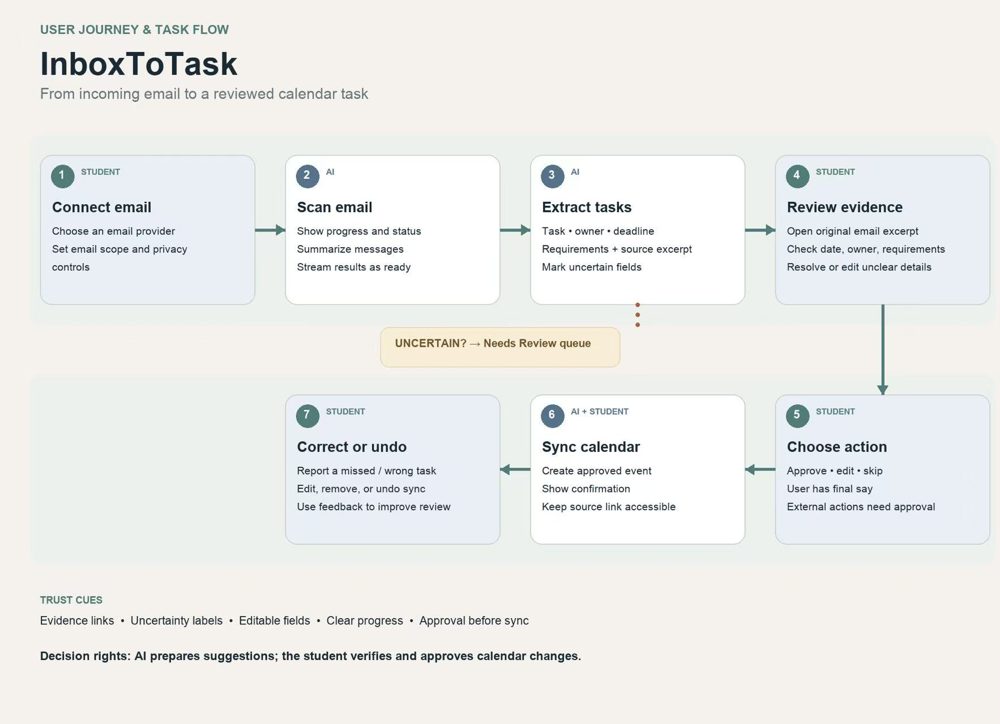
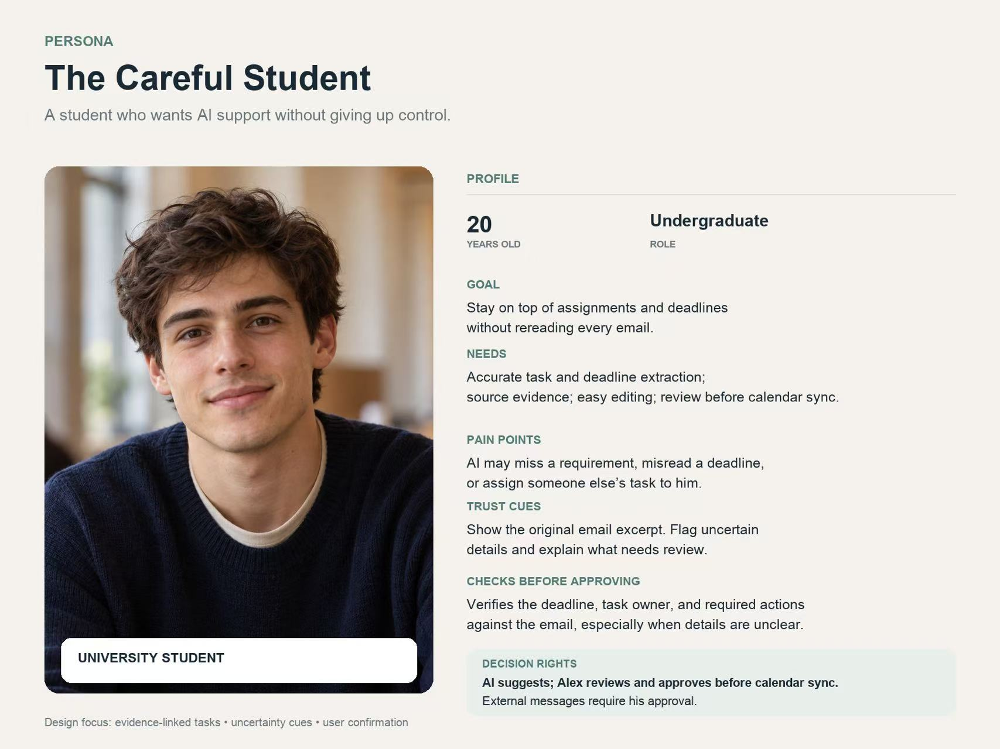
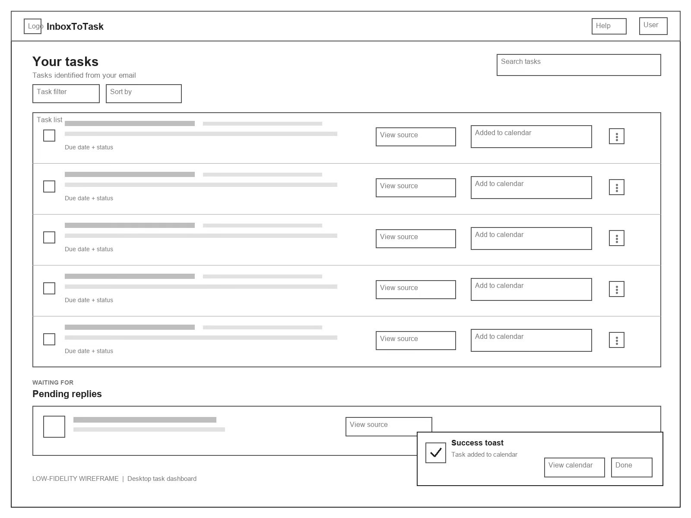

# Design Specification

## 1. User Journey & Task Flow

The diagram shows how students move from connecting their email accounts to reviewing AI-generated tasks and syncing approved tasks to their calendars.

## 2. User Persona

Our primary user is a university student who wants help managing emails and deadlines without losing control over important decisions. The design focuses on accuracy, transparency, and user approval.

## 3. Low-Fidelity Wireframe

The dashboard allows students to review extracted tasks, check their original email sources, and add approved tasks to their calendars.

# Design Specification Supplement

## Design System Alignment

**Selected design system: IBM Carbon Design System.** InboxToTask is a desktop-focused task review application that handles dense, structured information. Carbon provides components and reuse principles for structured data, task operations, and system feedback. Component behavior, spacing, typography, color tokens, focus states, and accessibility will follow Carbon. Components from other design systems will not be mixed in.

- **Task and information lists:** Use Carbon data table or list patterns to establish row hierarchy, subtle dividers, selected and hover states, and source and action entry points. Show the task title, owner, deadline, status, and source. Carbon data tables use layer and text tokens to distinguish headers, rows, selected states, and focus states. [Data table specifications](https://www.carbondesignsystem.com/building-blocks/core/components/data-table/specifications)
- **Primary and secondary actions:** Highlight the most important current action, such as “Approve and add.” Use secondary or tertiary buttons for “Edit,” “View source,” “Skip,” and “Undo.” Button labels should describe the action accurately. Focus, hover, active, and disabled states should follow Carbon guidance. [Button specifications](https://www.carbondesignsystem.com/building-blocks/core/components/button/specifications)
- **Processing progress and status feedback:** Show progress indicators and status text while analyzing emails. Use an inline notification for “Needs review” and a toast notification after a successful calendar update. Keep confirmation details in the task row after the notification disappears. Do not communicate status through color alone; pair text with icons. [Notification guidelines](https://www.carbondesignsystem.com/building-blocks/core/components/notification/guidelines)
- **Trust and AI behavior:** Mark task fields generated by AI, display excerpts from the original email, and highlight uncertain fields for verification. Students retain decision-making authority over task approval and external actions. These choices align with Carbon's guidance for trusted AI experiences. [Carbon for AI](https://www.carbondesignsystem.com/building-blocks/foundations/carbon-for-ai)
- **Accessibility:** Support keyboard interaction for reviewing, editing, approving, skipping, and undoing. Provide visible focus states and descriptive labels for icon-only controls. Show warning and success states with both text and icons, not color alone.

## Traceability to Steps 6–7

Step 6 describes human and AI roles across three cognitive dimensions—reasoning, memory, and attention—and how decision rights and escalation support coordination. Step 7 prioritizes features and interface elements by connecting empirical evidence to theory. The table below traces interface choices to those steps.

| Empirical Evidence (Step 5) | Theoretical Interpretation (Step 6) | Priority and Interface Choice (Step 7) |
|---|---|---|
| One interviewee worried that AI could misread deadlines, omit requirements, or assign another person's action to the student. Another interviewee emphasized the importance of verifying critical information. | **Memory + reasoning:** AI retrieves and organizes email information; people use context to make judgments. Showing the information source helps users verify AI reasoning. | **Priority 1 — Evidence-linked task review.** Show the task, owner, deadline, requirements, and original email excerpt together. Let students view the original email, edit fields, and approve the task. |
| Both interviewees emphasized the importance of checking information coverage and errors. DeepSeek missed two of the 20 target emails. | **Attention + memory:** AI filters emails, but the interface must make omissions, uncertainty, and errors visible to the human reviewer. | **Priority 1 — Completeness and uncertainty review.** Show scan progress, total email count, and number processed. Mark uncertain fields as “Needs review” and keep unverified items visible until resolved. |
| One interviewee wanted to retain decision-making authority and opposed automatic AI replies. Another interviewee manually reviews important emails. | **Meta-coordination / role division:** AI prepares suggestions, while people retain decision-making authority over consequential actions. | **Priority 1 — Approval checkpoint.** Do not add tasks or calendar events automatically. Require explicit authorization for external communication. |
| Both interviewees wanted to view the original email. The project also distinguishes task-based emails from informational emails. | **Shared memory:** People and AI need a shared, inspectable source of what the email says and how the system interprets it. | **Priority 2 — Separate digest views with source links.** Put task-based and informational emails in separate views, each with a “View original email” link. Informational emails should not create tasks automatically. |
| One interviewee could accept a summary taking up to three minutes, while the other preferred about one minute. | **Attention coordination:** Status information and progressive results help users allocate attention while AI processes emails. | **Priority 2 — Streaming progress feedback.** Show processing status and reveal results as they become ready. Test perceived responsiveness with 60- and 180-second processing targets. |
| Interviewees were concerned about AI errors. Validation notes also show that the system lacked information about action owners and follow-up recipients. | **Reasoning + meta-coordination:** The system must support corrections and disagreements, and distinguish AI suggestions from actions explicitly assigned to users. | **Priority 2 — Correction and undo.** Support field editing, error feedback, and undo after synchronization. Distinguish “waiting for a reply” from “suggested follow-up,” and show the recipient and rationale for each suggested follow-up. |
| One interviewee was concerned about sensitive information such as grades; the other did not raise similar concerns. | **Goals and constraints / role division:** The team needs to define what information AI can access and how other information will be kept private. | **Priority 3 — Privacy controls.** Explain the access scope before connection and provide controls for sensitive content and task handling. Validate these controls with additional interviewees. |

**Design principle:** Establish clear role division and coordinate user attention with the review process. InboxToTask lets AI scan and organize emails while students verify the evidence, resolve uncertainty, and authorize follow-up actions. At Checkpoint 3, compare this workflow with both required baselines: a human-only process and an AI-only process.
