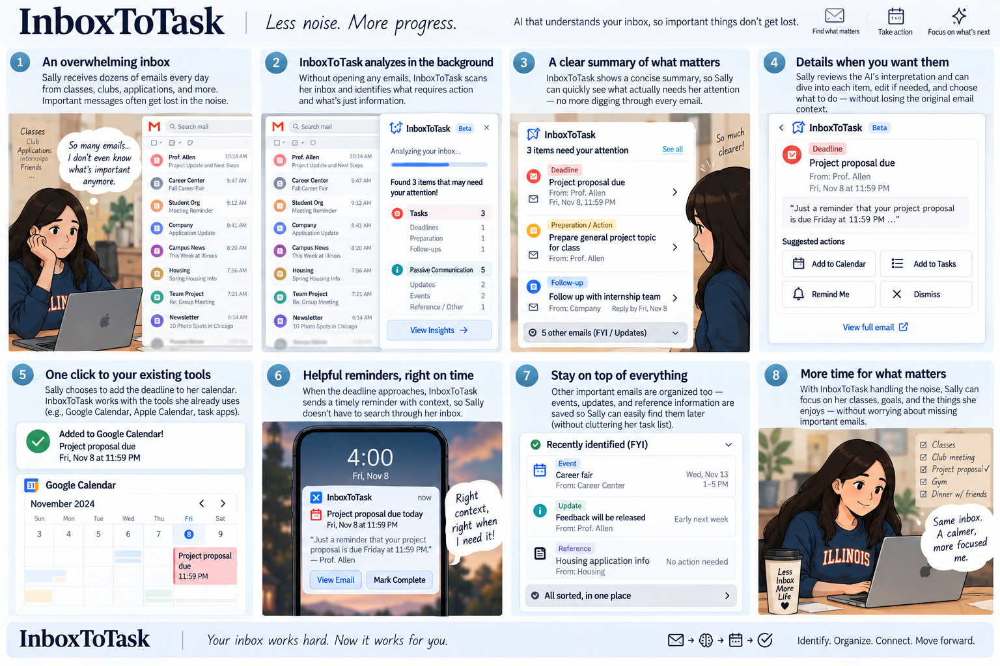

# Individual Validation Reflection — Sania Shah

## Prompting notes

For InboxToTask, I developed a test inbox with realistic student emails to examine how AI distinguishes tasks from passive communication. The scenarios included explicit deadlines, optional invitations, multiple requests within one email, canceled or completed tasks, and conditional follow-ups. The prompt asked the AI to identify outstanding actions, deadlines, waiting-for items, confidence scores, and a suggested attention order with explanations.

One observation from the Copilot output was that different sections did not always agree. For E09, it labeled the email passive and listed no outstanding tasks, but later included the requested conditional reminder under “Conditional Actions.” This showed that extracting the relevant information does not necessarily mean it will be represented consistently. For our design, a future follow-up needs to remain visible without appearing as something the user must do immediately.

## Interview notes

I interviewed two senior-year Computer Science students for approximately 20 minutes each. I explained the concept and asked about their current email workflows, expectations for automation, and concerns about accuracy and privacy. These were concept interviews rather than tests of a working prototype.

Both participants manually transferred email commitments into Google Calendar and considered missing a real task more concerning than generating an unnecessary one. They wanted calendar integration, customizable categories or filters, and simple ways to correct suggestions. Their automation preferences differed: one was comfortable automatically adding assignments to her calendar but wanted approval for meetings, while the other wanted approval before any calendar additions.

Verification and privacy were also important. One participant specifically wanted links to the original emails, and the other planned to continue reading her inbox rather than relying entirely on the tool. Both raised concerns about processing sensitive information.

## Class-generated storyboard

## One finding that changed (or confirmed) my assumption about the proposed scenario

Before the interviews, I focused mainly on whether InboxToTask would extract tasks correctly. Both participants pointing out that a missed task was more concerning than an unnecessary suggestion changed how I thought about accuracy. One explained that she could notice and dismiss a false task, but might never realize that a real task had been left out. This made me realize that a clean task list could give users a misleading sense that everything important had been captured.

I connect this finding to trust calibration: users need to understand what the AI can reliably help with and where checking is still necessary. For InboxToTask, that means making suggestions easy to verify through source-email links and simple editing controls, while being clear that the list may be incomplete. The AI can help direct attention to commitments, but users still need enough visibility and control to judge its output.
