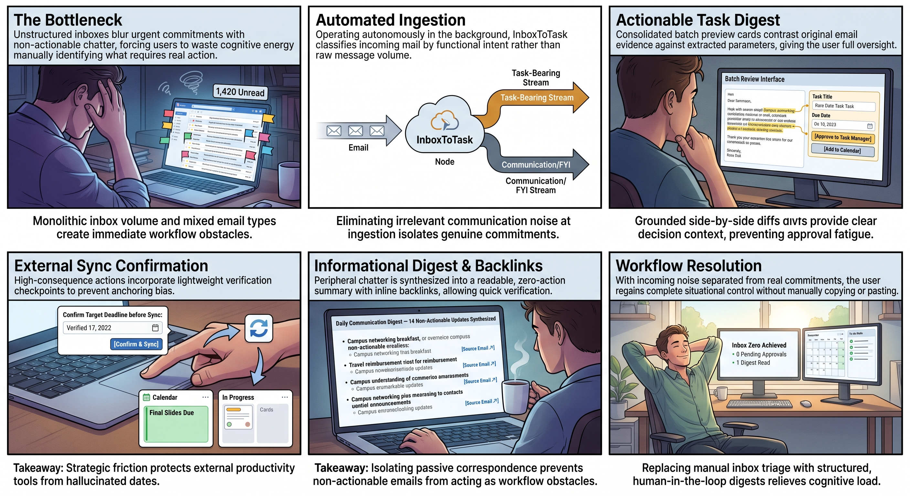

# Prompting Notes

Gemini 3.1 Pro seems to have classified the emails in our dataset well, reporting high confidence across all emails. However, it does not record who to follow up with or who should receive the requested action. We may need to update the prompting protocol to capture this information.

For email 19, the model suggested a follow-up, which was the behavior we wanted, but classified the email as passive. This may reflect how the prompt was designed. We should revisit the prompt to clarify how follow-up recommendations relate to the classification.

Currently the AI prompt does not have the Gen AI store who the message needs to follow up with or who the action needs to be sent to. This might need to be addressed via changes to the prompting protocol.

## Interview Notes

Both interviews pointed to a preference for human approval when creating tasks. Participants wanted to review and approve tasks before the AI created them. They also wanted access to the original email from the task or informational inbox where it had been sorted.

Participants were strongly concerned about the email tool making errors, reinforcing the need for human review and approval. The interviews also raised the idea of using color coding to highlight urgent tasks, which I had not previously considered.

Privacy concerns came up as well. We need to decide what information the tool can pull from emails and how users can control that access. This filtering would probably need to happen within the inbox, before emails are passed to the tool, since anything the tool receives would go through generative AI. A future option might be a local solution, such as Jev/Laya, that classifies emails according to the user’s preferences and determines which ones can be passed to the tool.

## Storyboard

## Reflection

> One finding that changed (or confirmed) my assumption about the proposed scenario

> Tie it to complementarity, trust calibration, shared mental models, or a cognitive pillar from the reading

One finding that strongly supported my initial assumptions was the role of trust calibration in AI systems that sort information, such as email. Our proposed interface aims to make large volumes of information easier to scan. The reading, however, warns about automation complacency: if users place too much trust in the AI’s sorting and summaries, they may stop reading the underlying emails altogether. We need to design a workflow that helps users work efficiently while making the AI’s decisions transparent and showing when manual review is needed.