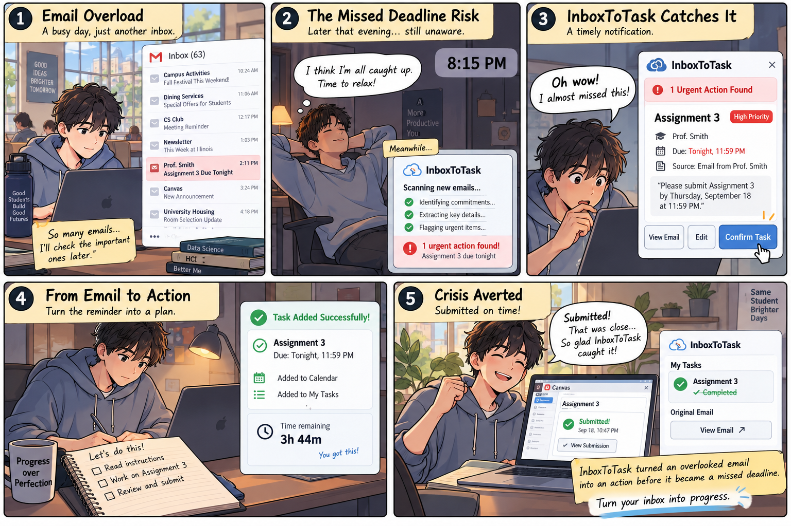

# Individual Validation Reflection — Yuchen Zhang

## Prompting notes

For InboxToTask, I reviewed ChatGPT and Claude outputs from a simulated inbox of 20 student emails. I looked at how they identified actionable emails, extracted tasks and deadlines, handled conditional reminders, and used earlier messages to avoid listing completed or canceled work. Both outputs identified 10 actionable and 10 passive emails, and both recognized that E09 required a reminder only if feedback had not arrived by Friday afternoon.

One case that stood out was E01 and E06. Claude noted that the two emails might refer to the same assignment but had different deadlines. Instead of merging them, it kept them separate and flagged the uncertainty. This was not necessarily an error, but it showed why users need to see the original emails when the AI cannot confidently determine whether two tasks are related.

## Interview notes

I interviewed two peers about their email habits and what they would expect from InboxToTask. We discussed accuracy, reliability, speed, human–AI collaboration, privacy, and cost. Both participants worried about AI missing important tasks or creating tasks that were not actually required. At the same time, one thought AI could catch details that people might overlook when checking a busy inbox.

Their preferences were not exactly the same. One wanted results within about 15 seconds to a minute, weekly task summaries, and help with scheduling. The other was willing to wait longer for accurate results and wanted to compare the generated task plan with the original emails. They also had different views on privacy and pricing: one was comfortable granting email access, while the other wanted stronger safeguards for sensitive information.

## Class-generated storyboard

## One finding that changed (or confirmed) my assumption about the proposed scenario

At first, I focused mainly on how InboxToTask could save students time by finding tasks in a crowded inbox. The interviews made me think more about whether users would actually trust the task list. Both participants worried about missed or incorrect tasks, and one specifically wanted to check the AI's suggestions against the original emails. That made me realize that even a fast and convenient tool might not be very useful if students cannot tell where its information came from.

I connect this finding to trust calibration and human–AI complementarity in Gonzalez et al. (2026). AI can help direct attention to important emails, but users still need enough context to judge the results. For InboxToTask, I think each suggested task should include a link to its source email and an easy way to edit or reject it before confirmation. This would let AI handle the repetitive scanning while students stay in control of their responsibilities.
